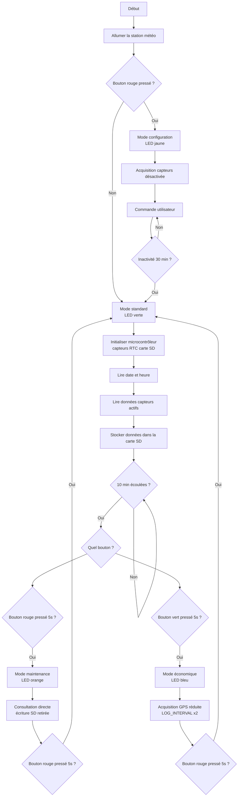
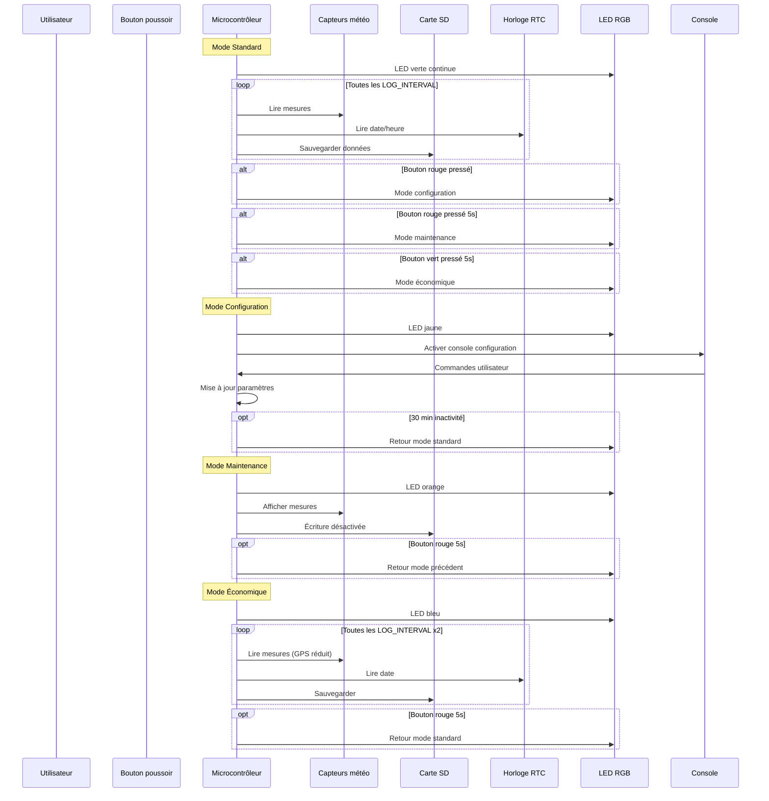
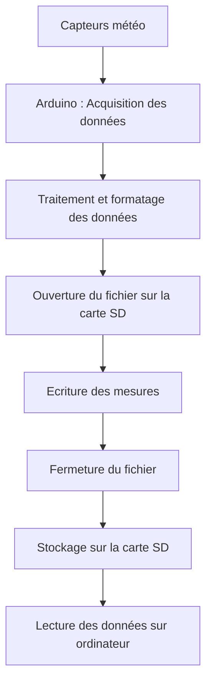

# Projet : Worldwide Weather Watcher


## Erradi Hatim; Sacha Lagnitre; Lett Killian; Cid Clément 

# Livrable 2 : Architecture du programme

# 1. Les diagrammes UML/SysML

## 1.1 Diagramme d'activité :

Ce diagramme d'activité décrit le fonctionnement général de la station météo et la gestion des différents modes du système.

Au démarrage, la station initialise le microcontrôleur ainsi que tous les périphériques nécessaires : capteurs météorologiques, horloge temps réel (RTC) et carte SD.

En mode standard, la LED verte est allumée en continu et la station effectue périodiquement les opérations suivantes :

* lecture des capteurs (température, humidité, pression, GPS),
* récupération de la date et de l’heure via le module RTC,
* sauvegarde des données sur la carte SD.

Le système vérifie régulièrement si un bouton a été pressé afin de changer de mode de fonctionnement.

Trois modes supplémentaires sont disponibles :

* **Mode configuration** : permet à l’utilisateur de modifier les paramètres via une console.
* **Mode maintenance** : permet de consulter directement les mesures sans enregistrer de données.
* **Mode économique** : réduit la fréquence d’acquisition afin de diminuer la consommation énergétique.

Après une période d’inactivité, le système revient automatiquement au mode standard.



## 1.2 Diagramme de séquence: 

Ce diagramme de séquence représente les interactions entre les différents composants du système : l’utilisateur, le microcontrôleur, les capteurs météorologiques, la carte SD, l’horloge RTC et les interfaces d’affichage.

En mode standard, le microcontrôleur lit périodiquement les mesures fournies par les capteurs, récupère la date et l’heure depuis le module RTC, puis enregistre les données sur la carte SD.

Lorsque l’utilisateur appuie sur un bouton, le microcontrôleur peut changer de mode de fonctionnement :

* **Mode configuration** : activation de la console pour modifier les paramètres du système.
* **Mode maintenance** : affichage des mesures sans enregistrement.
* **Mode économique** : réduction de la fréquence d’acquisition pour économiser l’énergie.

Le diagramme illustre également les conditions permettant de revenir au mode standard après une période d’inactivité ou après une action de l’utilisateur.




# 2. Structures logicielles du programme

## 2.1 Initialisation des périphériques

Au début du programme, on initialise tous les périphériques utilisés par la station météo.  
Le but est de déclarer dès le départ les composants matériels afin que le reste du code soit plus clair et plus simple à suivre.

Dans cette version du programme, on retrouve notamment :

- l’écran LCD  
- la LED RGB  
- le capteur DHT11 pour la température et l’humidité  
- une liaison série logicielle pour communiquer avec le GPS  

```cpp
rgb_lcd        lcd;
ChainableLED   led(8, 9, 1);
DHT            dht(6, DHT11);
SoftwareSerial gpsSerial(4, 5);  // RX, TX
```

Le programme définit aussi plusieurs constantes pour les broches et adresses utilisées.

```cpp
#define LUMIN_PIN        A1
#define BOUTON_ROUGE     2
#define BOUTON_VERT      3
#define SD_CS            10
#define RTC_ADDR         0x68
#define EEPROM_SIGNATURE 0x42
```

Cela permet d’éviter d’utiliser directement des numéros dans le code et rend le programme plus facile à modifier.


## 2.2 Gestion du RTC sans bibliothèque

Dans cette version du programme, l’horloge temps réel **DS1307** est utilisée sans bibliothèque externe.  
Le programme communique directement avec le composant via le bus **I2C** grâce à la bibliothèque `Wire`.

Une structure simple permet de stocker l’heure.

```cpp
struct DateTime { uint8_t h, m, s; };
```

Le DS1307 utilise un format **BCD** pour stocker les valeurs.  
Deux fonctions permettent donc de convertir les valeurs.

```cpp
static inline uint8_t bcdToDec(uint8_t v) { return (v >> 4) * 10 + (v & 0x0F); }
static inline uint8_t decToBcd(uint8_t v) { return ((v / 10) << 4) | (v % 10); }
```


## 2.3 Lecture de l’heure RTC

La fonction `rtcNow()` lit directement les registres du DS1307 pour récupérer l’heure actuelle.

```cpp
DateTime rtcNow() {
  Wire.beginTransmission(RTC_ADDR);
  Wire.write(0x00);
  Wire.endTransmission();
  Wire.requestFrom((uint8_t)RTC_ADDR, (uint8_t)3);
  DateTime dt;
  dt.s = bcdToDec(Wire.read() & 0x7F);
  dt.m = bcdToDec(Wire.read());
  dt.h = bcdToDec(Wire.read() & 0x3F);
  return dt;
}
```


## 2.4 Initialisation automatique du RTC

Si l’horloge est arrêtée, le programme initialise automatiquement le RTC avec la date et l’heure de compilation.

```cpp
void rtcAdjust() {
  uint8_t h = (__TIME__[0]-'0')*10 + (__TIME__[1]-'0');
  uint8_t m = (__TIME__[3]-'0')*10 + (__TIME__[4]-'0');
  uint8_t s = (__TIME__[6]-'0')*10 + (__TIME__[7]-'0');

  Wire.beginTransmission(RTC_ADDR);
  Wire.write(0x00);
  Wire.write(decToBcd(s));
  Wire.write(decToBcd(m));
  Wire.write(decToBcd(h));
  Wire.endTransmission();
}
```

Cette méthode permet d’avoir une heure valide lors du premier démarrage.


## 2.5 Gestion du GPS sans bibliothèque

Dans cette version, le GPS est géré sans la bibliothèque **TinyGPS++**.  
Le programme lit directement les trames **NMEA** envoyées par le module GPS.

Les données sont stockées dans une structure.

```cpp
struct GPSData { double lat, lon; bool valid; };
static GPSData gpsData = { 0.0, 0.0, false };
```

Un buffer permet de reconstruire les trames reçues.

```cpp
static char    nmeaBuf[90];
static uint8_t nmeaIdx = 0;
```


## 2.6 Conversion des coordonnées GPS

Les coordonnées GPS reçues sont au format **DDDMM.MMMM**.  
La fonction suivante les convertit en degrés décimaux.

```cpp
static double nmea2deg(const char* s) {
  double raw = atof(s);
  int deg = (int)(raw / 100.0);
  return deg + (raw - deg * 100.0) / 60.0;
}
```


## 2.7 Lecture continue du GPS

La fonction `readGPS()` lit les caractères reçus depuis le module GPS et reconstruit les trames NMEA.

```cpp
void readGPS() {
  while (gpsSerial.available()) {
    char c = (char)gpsSerial.read();
    if (c == '$') nmeaIdx = 0;
    if (nmeaIdx < sizeof(nmeaBuf) - 1) nmeaBuf[nmeaIdx++] = c;
    if (c == '\n' || c == '\r') {
      nmeaBuf[nmeaIdx] = '\0';
      if (nmeaIdx > 6) parseNMEA(nmeaBuf);
      nmeaIdx = 0;
    }
  }
}
```


## 2.8 Structure de configuration

Les paramètres importants du programme sont regroupés dans la structure `Variable`.

```cpp
struct Variable {
  unsigned int DUREE_APPUI_LONG, CONFIG_TIMEOUT, LOG_INTERVAL;
  bool LUMIN; int LUMIN_LOW, LUMIN_HIGH;
  bool TEMP_AIR; int MIN_TEMP_AIR, MAX_TEMP_AIR;
  bool HYGR; int HYGR_MINT, HYGR_MAXT;
  bool PRESSURE; int PRESSURE_MIN, PRESSURE_MAX;
};
```
On va retrouve si dessous la fonction TraiterCommande qui est l'outil principal pour les commandes sur le serial monitor lors du passage en mode configuration.
```cpp
void traiterCommande(String &cmd) {
  cmd.trim();
  if (cmd == F("RESET"))   { resetParametres(); return; }
  if (cmd == F("VERSION")) { Serial.println(F("Station Meteo v1.0")); return; }

  int sep = cmd.indexOf('=');
  if (sep < 0) { Serial.println(F("Syntaxe: CLE=VALEUR")); return; }

  String var = cmd.substring(0, sep);
  int    val = cmd.substring(sep + 1).toInt();

  if      (var == F("LOG_INTERVAL"))     config.LOG_INTERVAL     = (unsigned int)val * 1000;
  else if (var == F("DUREE_APPUI_LONG")) config.DUREE_APPUI_LONG = (unsigned int)val * 1000;
  else if (var == F("CONFIG_TIMEOUT"))   config.CONFIG_TIMEOUT   = (unsigned int)val * 1000;
  else if (var == F("LUMIN"))            config.LUMIN            = val != 0;
  else if (var == F("LUMIN_LOW"))        config.LUMIN_LOW        = val;
  else if (var == F("LUMIN_HIGH"))       config.LUMIN_HIGH       = val;
  else if (var == F("TEMP_AIR"))         config.TEMP_AIR         = val != 0;
  else if (var == F("MIN_TEMP_AIR"))     config.MIN_TEMP_AIR     = val;
  else if (var == F("MAX_TEMP_AIR"))     config.MAX_TEMP_AIR     = val;
  else if (var == F("HYGR"))             config.HYGR             = val != 0;
  else if (var == F("HYGR_MINT"))        config.HYGR_MINT        = val;
  else if (var == F("HYGR_MAXT"))        config.HYGR_MAXT        = val;
  else if (var == F("PRESSURE"))         config.PRESSURE         = val != 0;
  else if (var == F("PRESSURE_MIN"))     config.PRESSURE_MIN     = val;
  else if (var == F("PRESSURE_MAX"))     config.PRESSURE_MAX     = val;
  else { Serial.println(F("Commande inconnue")); return; }

  sauvegarderEEPROM();
  Serial.print(var); Serial.println(F(" applique"));
}
```

## 2.9 Valeurs par défaut

Les valeurs par défaut sont stockées en mémoire programme.

```cpp
static const Variable CONFIG_DEFAULT PROGMEM = {
  3000, 20000, 10000,
  true,255,768,
  true,-10,60,
  true,0,50,
  true,850,1080
};
```

La configuration active est stockée dans :

```cpp
Variable config;
```


## 2.10 Sauvegarde et chargement de l’EEPROM

Les paramètres sont sauvegardés dans l’EEPROM afin d’être conservés après redémarrage.

```cpp
void sauvegarderEEPROM() {
  EEPROM.update(0, EEPROM_SIGNATURE);
  EEPROM.put(1, config);
}
```

```cpp
void chargerEEPROM() {
  if (EEPROM.read(0) != EEPROM_SIGNATURE) {
    memcpy_P(&config, &CONFIG_DEFAULT, sizeof(config));
  } else {
    EEPROM.get(1, config);
  }
}
```


## 2.11 Machine à états

Le programme utilise une machine à états pour gérer les différents modes.

```cpp
enum ModeCapteur : uint8_t { STANDARD, CONFIGURATION, MAINTENANCE, ECONOMIQUE };
ModeCapteur modeActuel    = STANDARD;
ModeCapteur modePrecedent = STANDARD;
```

Chaque mode correspond à un comportement différent du système.


## 2.12 Gestion du temps

Le programme utilise plusieurs timers pour gérer les actions périodiques.

```cpp
const uint16_t LCD_REFRESH = 1000;
const uint8_t DEBOUNCE_DELAY = 50;

unsigned long lastMeasure = 0;
unsigned long lastLCDRefresh = 0;
unsigned long derniereActivite = 0;
```


## 2.13 Gestion des boutons avec interruptions

Les boutons utilisent des interruptions pour améliorer la réactivité.

```cpp
volatile bool rougeEvent = false;
volatile bool vertEvent  = false;

void ISR_boutonRouge() { rougeEvent = true; }
void ISR_boutonVert()  { vertEvent  = true; }
```


## 2.14 Fonction principale de mesure

La fonction `afficherEtEnregistrer()` centralise la lecture des capteurs et l’enregistrement des données.

Elle réalise :

- lecture de l’heure
- lecture du capteur DHT11
- lecture de la luminosité
- récupération des coordonnées GPS
- affichage sur le port série
- enregistrement sur la carte SD
```cpp
void afficherEtEnregistrer(bool ecrireSD) {
  DateTime t   = rtcNow();
  float temp   = dht.readTemperature();
  float hum    = dht.readHumidity();
  int   lum    = analogRead(LUMIN_PIN);
  bool  dhtOK  = !isnan(temp) && !isnan(hum);

  // --- Série ---
  afficherHeure(Serial, t);
  if (dhtOK) { Serial.print(F(" | T:")); Serial.print(temp, 1); Serial.print(F("C | H:")); Serial.print(hum, 1); Serial.print('%'); }
  else          Serial.print(F(" | T:ERR | H:ERR"));
  Serial.print(F(" | L:")); Serial.print(lum);
  if (gpsData.valid) { Serial.print(F(" | Lat:")); Serial.print(gpsData.lat, 6); Serial.print(F(" Lon:")); Serial.print(gpsData.lon, 6); }
  else                 Serial.print(F(" | GPS:-"));
  Serial.println();

  // --- Carte SD ---
  if (!ecrireSD) return;
  File f = SD.open("meteo.txt", FILE_WRITE);
  if (f) {
    afficherHeure(f, t);
    if (dhtOK) { f.print(F(" | T:")); f.print(temp, 1); f.print(F("C | H:")); f.print(hum, 1); f.print('%'); }
    else          f.print(F(" | T:ERR | H:ERR"));
    f.print(F(" | L:")); f.print(lum);
    if (gpsData.valid) { f.print(F(" | Lat:")); f.print(gpsData.lat, 6); f.print(F(" Lon:")); f.print(gpsData.lon, 6); }
    else                 f.print(F(" | GPS:-"));
    f.println(); f.close();
  } else Serial.println(F("Err SD!"));
}
```


## 2.15 Fonction setup()

La fonction `setup()` est exécutée une seule fois au démarrage.

Elle initialise :

- la communication série
- le GPS
- le bus I2C
- le capteur DHT
- l’écran LCD
- la carte SD
- les interruptions des boutons
- la configuration EEPROM
  
```cpp
void setup() {
  Serial.begin(9600);
  gpsSerial.begin(9600);
  Wire.begin();

  if (!rtcRunning()) {
    Serial.println(F("RTC arrete, init..."));
    rtcAdjust();
  }

  dht.begin();
  pinMode(LUMIN_PIN,    INPUT);
  pinMode(BOUTON_ROUGE, INPUT_PULLUP);
  pinMode(BOUTON_VERT,  INPUT_PULLUP);

  lcd.begin(16, 2);
  lcd.setRGB(0, 255, 0);

  if (!SD.begin(SD_CS)) {
    Serial.println(F("Err SD!"));
  } else {
    Serial.println(F("SD OK"));
    if (SD.exists("meteo.txt")) { SD.remove("meteo.txt"); Serial.println(F("Log efface")); }
  }

  attachInterrupt(digitalPinToInterrupt(BOUTON_ROUGE), ISR_boutonRouge, CHANGE);
  attachInterrupt(digitalPinToInterrupt(BOUTON_VERT),  ISR_boutonVert,  CHANGE);

  chargerEEPROM();
  modeActuel = STANDARD;
  updateModeHandler();
  Serial.println(F("Systeme demarre."));
}
````
## 2.16 Fonction loop()

La fonction `loop()` correspond à la boucle principale du programme.

Elle effectue en continu :

- lecture du GPS
- gestion des boutons
- gestion du timeout du mode configuration
- exécution du mode actif
- mise à jour de l’écran LCD

```cpp
void loop() {
  unsigned long now = millis();

  readGPS(); // lecture permanente du buffer GPS

  traiterBouton(BOUTON_ROUGE, rougeEvent, debutRouge, lastDebounceRouge, rougeCourte, rougeLongue);
  traiterBouton(BOUTON_VERT,  vertEvent,  debutVert,  lastDebounceVert,  nullptr,     vertLongue);

  if (modeActuel == CONFIGURATION && now - derniereActivite >= config.CONFIG_TIMEOUT) {
    modeActuel = STANDARD;
    lastLCDRefresh = 0;
    updateModeHandler();
  }

  if (modeHandler) modeHandler();
  afficherLCD();

  delay(50);
}

```

Le programme fonctionne ainsi en permanence tant que la carte Arduino est alimentée.

# Livrable 4- Documentation

# Documentation technique

# 1. Fonctionnement global du système 

Le système a pour objectif de collecter les données des capteurs de la station météo et de les enregistrer sur une carte SD afin de conserver les mesures sur une longue durée, et le prototype repose sur une carte Arduino. 

Le fonctionnement du systéme se déroule sur plusieurs étapes:



1. Les capteurs mesurent les paramètres météorologiques (température, pression, humidité).

2. L’Arduino récupère ces données.

3. Les données sont formatées sous forme de ligne de texte.

4. La carte SD est initialisée par le programme.

5. Les données sont écrites dans un fichier d’archivage.

6. Le fichier est fermé afin de sauvegarder correctement les données.

Le système recommence le processus pour chaque nouvelle mesure.

Le fonctionnement global du système repose sur un cycle d’acquisition et d’enregistrement des données.
Dans un premier temps, les capteurs mesurent les différentes grandeurs physiques comme la température, la pression ou l’humidité. Ces informations sont ensuite transmises à la carte Arduino.
L’Arduino traite ces données et les convertit dans un format exploitable. Une fois les données prêtes, le programme ouvre un fichier d’archivage sur la carte SD.
Les mesures sont ensuite écrites dans ce fichier, puis le fichier est fermé afin d’assurer la sauvegarde correcte des informations.
Ce processus se répète automatiquement à intervalles réguliers afin d’enregistrer les données tout au long de l’utilisation de la station météo.
Les données enregistrées peuvent ensuite être récupérées en retirant la carte SD et en l’insérant dans un ordinateur.

# 2. Architecture générale du programme

Le programme de la station météo est organisé en plusieurs modules permettant de gérer les capteurs, l’affichage, l’enregistrement des données et l’interaction avec l’utilisateur. Cette organisation modulaire facilite la compréhension du code et permet de maintenir plus facilement le système.

Le programme Arduino repose sur deux fonctions principales :

- `setup()` : exécutée une seule fois au démarrage du système.
- `loop()` : exécutée en continu pendant toute la durée de fonctionnement de la station.

---

# 3. Initialisation du système

Lors du démarrage, la fonction `setup()` initialise tous les périphériques nécessaires au fonctionnement du système.

Les éléments suivants sont configurés :

- la communication série pour l’affichage des informations
- le module GPS
- le bus I²C pour la communication avec certains capteurs
- l’horloge temps réel (RTC)
- le capteur de température et d’humidité
- le capteur de luminosité
- l’écran LCD
- la carte SD pour le stockage des données
- les boutons permettant d’interagir avec le système

La configuration enregistrée dans la mémoire **EEPROM** est également chargée afin de restaurer les paramètres précédemment définis.

---

# 4. Organisation en modes de fonctionnement

Le système possède plusieurs **modes de fonctionnement** permettant d’adapter le comportement de la station selon les besoins.

| Mode | Description |
|-----|-----|
| **Standard** | fonctionnement normal avec acquisition et enregistrement des données |
| **Configuration** | modification des paramètres via le port série |
| **Maintenance** | affichage des données des capteurs sans enregistrement |
| **Économique** | réduction de la fréquence des mesures pour économiser l’énergie |

Chaque mode est associé à une fonction spécifique chargée d’exécuter les opérations correspondantes. Le programme utilise un **pointeur de fonction** permettant d’exécuter dynamiquement la fonction correspondant au mode actif.

---

# 5. Acquisition et traitement des données

Les données environnementales sont collectées à partir de plusieurs capteurs :

- **DHT11** : mesure de la température et de l’humidité  
- **Capteur analogique** : mesure de la luminosité  
- **Module GPS** : récupération des coordonnées géographiques  
- **Module RTC** : gestion de la date et de l’heure  

Les informations collectées sont ensuite traitées et formatées afin d’être affichées et enregistrées dans un format lisible.

---

# 6. Affichage des informations

Les informations du système sont affichées sur deux interfaces :

- le **moniteur série**, utilisé pour le suivi et le diagnostic
- l’**écran LCD**, qui affiche l’heure actuelle ainsi que le mode de fonctionnement actif

L’affichage est mis à jour régulièrement afin de fournir des informations en temps réel à l’utilisateur.

---

# 7. Enregistrement des données

Les données collectées peuvent être enregistrées sur une **carte SD** dans un fichier nommé :


# Documentation utilisateur - Station météo embarquée


# 1. Contexte du projet

Dans le cadre du projet **Worldwide Weather Watcher**, l’Agence Internationale pour la Vigilance Météorologique (AIVM) souhaite améliorer la surveillance des phénomènes météorologiques dangereux comme les cyclones et tempêtes tropicales.

Pour cela, l’agence déploie des **stations météo embarquées sur des navires commerciaux**. Ces stations permettent de mesurer et enregistrer plusieurs paramètres environnementaux importants afin de mieux comprendre et anticiper les phénomènes météorologiques extrêmes.

Le système doit être :

- simple à utiliser
- fiable en environnement maritime
- accessible à un membre de l’équipage sans compétences techniques avancées

Cette documentation a pour objectif de **guider l’utilisateur final dans l’utilisation de la station météo embarquée**.


# 2. Présentation du système

La station météo est un système embarqué basé sur un microcontrôleur qui collecte et enregistre plusieurs données météorologiques.

Le système repose sur :

- Arduino Uno  
- microcontrôleur ATmega328

Le microcontrôleur gère :

- l’acquisition des données des capteurs
- l’enregistrement des données
- les modes de fonctionnement
- l’interface utilisateur (LED, boutons, écran)


# 3. Composants du système

## 3.1 Capteurs météorologiques

La station mesure plusieurs paramètres environnementaux.

### Température et humidité

Capteur utilisé :
- DHT11
  


Mesures :

- température de l’air
- humidité relative


### Luminosité

Capteur analogique permettant de mesurer l’intensité lumineuse ambiante.


### Position GPS


Le module GPS permet d’obtenir :

- la latitude
- la longitude

Ces données permettent de **localiser précisément la position du navire lors de chaque mesure**.


### Horloge temps réel

Module utilisé :

- RTC DS1307
  


Fonction :

- fournir la date et l’heure
- horodater les données enregistrées


### Carte SD

Un lecteur de carte SD permet de **stocker les données météorologiques enregistrées**.


Chaque ligne du fichier contient :

- la date
- l’heure
- les données des capteurs
- la position GPS


# 4. Interface utilisateur

L’utilisateur interagit avec le système grâce à :

- une LED RGB

  
  
- un écran LCD


- 2 boutons poussoirs
  


Ces éléments permettent de **contrôler les modes du système et vérifier son état de fonctionnement**.


# 5. Boutons de contrôle

## Bouton rouge

Le bouton rouge permet d’accéder aux modes avancés.

**Appui court :**

→ passage en **mode configuration**

**Appui long (5 secondes) :**

→ passage en **mode maintenance**

Si le système est déjà en mode maintenance, un appui long permet de **revenir au mode précédent**.


## Bouton vert

**Appui long (5 secondes) :**

→ activation du **mode économique**

Ce mode est accessible uniquement depuis le mode standard.


# 6. Indicateurs LED

Une LED RGB indique l’état du système.

| Couleur LED | État du système |
|-------------|----------------|
| Vert | Mode standard |
| Jaune | Mode configuration |
| Bleu | Mode économique |
| Orange | Mode maintenance |

Ces couleurs permettent à l’utilisateur **d’identifier rapidement le mode actif du système**.


# 7. Signaux d’erreur

Certaines combinaisons de couleurs indiquent une erreur.

| Signal LED | Signification |
|------------|--------------|
| Rouge + Bleu clignotant | erreur horloge RTC |
| Rouge + Jaune clignotant | erreur GPS |
| Rouge + Vert clignotant | erreur capteur |
| Rouge + Vert clignotant (vert plus long) | données capteur incohérentes |
| Rouge + Blanc clignotant | carte SD pleine |
| Rouge + Blanc clignotant (blanc plus long) | erreur écriture carte SD |

Ces signaux permettent **d’identifier rapidement un problème matériel ou logiciel**.


# 8. Modes de fonctionnement

## La station météo possède **4 modes de fonctionnement**.

## 8.1 Mode Standard

 Le **mode standard** est le mode normal de fonctionnement.

Fonctionnement :

- acquisition des données des capteurs
- enregistrement sur la carte SD
- affichage sur l’écran LCD

Les mesures sont effectuées **toutes les 10 minutes par défaut**.

Les données sont enregistrées sous forme de lignes horodatées dans un fichier de log.


## 8.2 Mode Configuration

Ce mode permet de **configurer les paramètres du système** via l’interface série.

Exemples de commandes (voire en annexe le reste) :

LOG_INTERVAL=10
RESET
VERSION


Le système revient automatiquement en **mode standard après 30 minutes sans activité**.


## 8.3 Mode Maintenance

Dans ce mode :

- les données ne sont **plus écrites sur la carte SD**
- les capteurs peuvent être **consultés en direct sur le port série**
- la carte SD peut être retirée **sans risque de corruption des données**

Ce mode est utilisé pour :

- diagnostic
- maintenance du système


## 8.4 Mode Économique

Ce mode permet **d’économiser de l’énergie**.

Modifications du fonctionnement :

- acquisition GPS seulement **une mesure sur deux**
- intervalle entre mesures **multiplié par 2**

Ce mode est utile lorsque la station fonctionne sur batterie.


# 9. Utilisation du système

## 9.1 Démarrage

1. Alimenter la station météo
2. Le système démarre automatiquement en **mode standard**
3. La LED devient **verte**
4. Les mesures commencent automatiquement


## 9.2 Vérification du fonctionnement

L’utilisateur doit vérifier :

- la couleur de la LED
- l’affichage sur l’écran LCD
- la présence des fichiers sur la carte SD


# 10. Maintenance simple

En cas de problème :

1. vérifier l’alimentation du système
2. vérifier la présence de la carte SD
3. vérifier les connexions des capteurs
4. redémarrer le système


# Conclusion

La station météo du projet **Worldwide Weather Watcher** permet de collecter automatiquement des données environnementales importantes pour la surveillance météorologique mondiale.

Grâce à son interface simple (LED, boutons et écran), le système peut être utilisé facilement par l’équipage d’un navire sans connaissances techniques avancées.


# Annexe :

## Fonction du mode configuration

| Paramètre      | Description                                                                 | Exemple de commande    |
|----------------|-----------------------------------------------------------------------------|-----------------------|
| LUMIN          | définition de l’activation (1)/désactivation (0) du capteur de luminosité  | LUMIN=1               |
| LUMIN_LOW      | définition de la valeur en dessous de laquelle la luminosité est considérée comme "faible" | LUMIN_LOW=200         |
| LUMIN_HIGH     | définition de la valeur au-dessus de laquelle la luminosité est considérée comme "forte" | LUMIN_HIGH=700        |
| TEMP_AIR       | définition de l’activation (1)/désactivation (0) du capteur de température de l’air | TEMP_AIR=0            |
| MIN_TEMP_AIR   | définition du seuil de température de l’air (en °C) en dessous duquel le capteur se mettra en erreur | MIN_TEMP_AIR=-5       |
| MAX_TEMP_AIR   | définition du seuil de température de l’air (en °C) au-dessus duquel le capteur se mettra en erreur | MAX_TEMP_AIR=30       |
| HYGR           | définition de l’activation (1)/désactivation (0) du capteur d’humidité      | HYGR=1                |
| HYGR_MINT      | définition de la température en dessous de laquelle les mesures d’hygrométrie ne seront pas prises en compte | HYGR_MINT=0           |
| HYGR_MAXT      | définition de la température au-dessus de laquelle les mesures d’hygrométrie ne seront pas prises en compte | HYGR_MAXT=50          |
| PRESSURE       | définition de l’activation (1)/désactivation (0) du capteur de pression atmosphérique | PRESSURE=0           |
| PRESSURE_MIN   | définition du seuil de pression atmosphérique (en hPa) en dessous duquel le capteur se mettra en erreur | PRESSURE_MIN=450      |
| PRESSURE_MAX   | définition du seuil de pression atmosphérique (en hPa) au-dessus duquel le capteur se mettra en erreur | PRESSURE_MAX=1030     |

Le code complet se trouve dans la section Main.c
