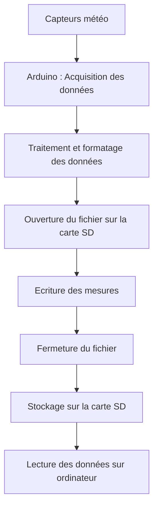

# Structures logicielles du programme

## Structure de configuration

Dans notre programme, toutes les variables importantes du système sont regroupées dans une structure appelée `Variable`.  
L’idée est simple : plutôt que d’avoir plein de variables dispersées dans le code, on rassemble tous les paramètres dans une seule structure.

Cela permet de garder un code plus clair et plus facile à modifier.

Dans cette structure, on retrouve par exemple :

- les paramètres généraux du système
- les seuils des capteurs
- les options d’activation ou non de certains capteurs

```c
struct Variable {

    unsigned int DUREE_APPUI_LONG;
    unsigned int CONFIG_TIMEOUT;
    unsigned int LOG_INTERVAL;

    bool LUMIN;
    int LUMIN_LOW;
    int LUMIN_HIGH;

    bool TEMP_AIR;
    int MIN_TEMP_AIR;
    int MAX_TEMP_AIR;

    bool HYGR;
    int HYGR_MINT;
    int HYGR_MAXT;

    bool PRESSURE;
    int PRESSURE_MIN;
    int PRESSURE_MAX;
};
```

Ensuite, une variable globale appelée `config` est utilisée pour stocker la configuration active du système.

```c
Variable config = {
    3000, 20000, 10000,
    1, 255, 768,
    1, -10, 60,
    1, 0, 50,
    1, 850, 1080
};
```

Cela permet d’avoir toutes les valeurs par défaut directement au démarrage du programme.


## Sauvegarde des paramètres dans l’EEPROM

Pour éviter de perdre les paramètres lors d’un redémarrage du système, la configuration peut être sauvegardée dans la mémoire **EEPROM**.

Deux fonctions sont utilisées pour gérer cela :

- `sauvegarderEEPROM()`
- `chargerEEPROM()`

```c
void sauvegarderEEPROM() {
  EEPROM.update(0, EEPROM_SIGNATURE);
  EEPROM.put(1, config);
}
```

La fonction `sauvegarderEEPROM()` permet d’enregistrer la structure `config` dans la mémoire EEPROM.

De l’autre côté, la fonction `chargerEEPROM()` permet de récupérer les paramètres au démarrage du système.

```c
bool chargerEEPROM() {
  if(EEPROM.read(0) != EEPROM_SIGNATURE){
    Serial.println(F("EEPROM invalide, valeurs par defaut"));
    return false;
  }
  EEPROM.get(1, config);
  return true;
}
```

Une signature (`EEPROM_SIGNATURE`) est utilisée pour vérifier que les données présentes en mémoire sont valides.

Si la signature ne correspond pas, le programme considère que l’EEPROM n’est pas initialisée et utilise donc les valeurs par défaut.


## Machine à états (gestion des modes)

Le fonctionnement global du programme repose sur une **machine à états**.  
Cela signifie que le système peut fonctionner dans plusieurs modes différents.

Ces modes sont définis dans une énumération appelée `ModeCapteur`.

```c
enum ModeCapteur {
    STANDARD,
    CONFIGURATION,
    MAINTENANCE,
    ECONOMIQUE
};
```

Chaque mode correspond à un comportement précis du système.

Par exemple :

- le mode **STANDARD** correspond au fonctionnement normal de la station météo
- le mode **CONFIGURATION** permet de modifier les paramètres via le port série
- le mode **MAINTENANCE** permet de tester les capteurs sans écrire sur la carte SD
- le mode **ECONOMIQUE** réduit la fréquence des mesures pour économiser l’énergie

Le mode courant est stocké dans la variable :

```c
ModeCapteur modeActuel;
```

Le programme adapte ensuite son comportement en fonction de ce mode.


## Utilisation des pointeurs de fonction

Pour gérer les différents modes de manière plus propre, le programme utilise un **pointeur de fonction**.

Un type spécial est défini :

```c
typedef void (*ModeHandler)();
ModeHandler modeHandler = nullptr;
```

Chaque mode possède sa propre fonction :

```c
void modeStandard();
void modeConfiguration();
void modeMaintenance();
void modeEconomique();
```

Une fonction appelée `updateModeHandler()` permet d’associer la bonne fonction au mode actuel.

```c
void updateModeHandler(){
  switch(modeActuel){
    case STANDARD: modeHandler = &modeStandard; break;
    case CONFIGURATION: modeHandler = &modeConfiguration; break;
    case MAINTENANCE: modeHandler = &modeMaintenance; break;
    case ECONOMIQUE: modeHandler = &modeEconomique; break;
  }
}
```

Ensuite, dans la boucle principale, il suffit simplement d’exécuter :

```c
modeHandler();
```

Cela permet d’appeler automatiquement la fonction correspondant au mode actif.

Cette technique rend le code beaucoup plus propre et évite d’avoir de nombreuses conditions dans la boucle principale.


## Gestion des boutons

L’utilisateur peut interagir avec le système grâce à deux boutons :

- un bouton rouge
- un bouton vert

Pour améliorer la réactivité du programme, la gestion des boutons utilise des **interruptions**.

Lorsque l’état d’un bouton change, une interruption est déclenchée et modifie un indicateur.

```c
volatile bool rougeEvent = false;
volatile bool vertEvent  = false;
```

Ces indicateurs sont ensuite analysés dans la boucle principale grâce à une fonction générique appelée `traiterBouton()`.

```c
void traiterBouton(...);
```

Cette fonction permet notamment de détecter :

- les appuis courts
- les appuis longs

Selon la durée de l’appui, différentes actions peuvent être exécutées, comme changer de mode de fonctionnement.


## Organisation générale du programme

Comme tous les programmes Arduino, celui-ci est organisé autour de deux fonctions principales :

### Setup

La fonction `setup()` est exécutée une seule fois au démarrage du système.

Elle permet notamment :

- d’initialiser les communications série
- de démarrer les capteurs
- de configurer les entrées et sorties
- de charger les paramètres depuis l’EEPROM
- d’initialiser la carte SD
- de définir le mode de fonctionnement initial


### Loop

La fonction `loop()` constitue la boucle principale du programme.

Elle est exécutée en continu tant que le système est alimenté.

Dans cette boucle, le programme :

- lit les données GPS
- gère les appuis sur les boutons
- vérifie les timeouts
- exécute la fonction correspondant au mode actif
- met à jour l’affichage LCD

Cette organisation permet au système de fonctionner en continu tout en restant capable de changer de mode et de réagir aux actions de l’utilisateur.

# Livrable 4- Documentation

## Documentation technique

1.1 Fonctionnement global du système 

Le système a pour objectif de collecter les données des capteurs de la station météo et de les enregistrer sur une carte SD afin de conserver les mesures sur une longue durée, et le prototype repose sur une carte Arduino. 

Le fonctionnement du systéme se déroule sur plusieurs étapes:



1. Les capteurs mesurent les paramètres météorologiques (température, pression, humidité).

2. L’Arduino récupère ces données.

3. Les données sont formatées sous forme de ligne de texte.

4. La carte SD est initialisée par le programme.

5. Les données sont écrites dans un fichier d’archivage.

6. Le fichier est fermé afin de sauvegarder correctement les données.

Le système recommence le processus pour chaque nouvelle mesure.

Le fonctionnement global du système repose sur un cycle d’acquisition et d’enregistrement des données.
Dans un premier temps, les capteurs mesurent les différentes grandeurs physiques comme la température, la pression ou l’humidité. Ces informations sont ensuite transmises à la carte Arduino.
L’Arduino traite ces données et les convertit dans un format exploitable. Une fois les données prêtes, le programme ouvre un fichier d’archivage sur la carte SD.
Les mesures sont ensuite écrites dans ce fichier, puis le fichier est fermé afin d’assurer la sauvegarde correcte des informations.
Ce processus se répète automatiquement à intervalles réguliers afin d’enregistrer les données tout au long de l’utilisation de la station météo.
Les données enregistrées peuvent ensuite être récupérées en retirant la carte SD et en l’insérant dans un ordinateur.

1.3 Architecture générale du programme

# Documentation technique

## Architecture générale du programme

Le programme de la station météo est organisé en plusieurs modules permettant de gérer les capteurs, l’affichage, l’enregistrement des données et l’interaction avec l’utilisateur. Cette organisation modulaire facilite la compréhension du code et permet de maintenir plus facilement le système.

Le programme Arduino repose sur deux fonctions principales :

- `setup()` : exécutée une seule fois au démarrage du système.
- `loop()` : exécutée en continu pendant toute la durée de fonctionnement de la station.

---

## Initialisation du système

Lors du démarrage, la fonction `setup()` initialise tous les périphériques nécessaires au fonctionnement du système.

Les éléments suivants sont configurés :

- la communication série pour l’affichage des informations
- le module GPS
- le bus I²C pour la communication avec certains capteurs
- l’horloge temps réel (RTC)
- le capteur de température et d’humidité
- le capteur de luminosité
- l’écran LCD
- la carte SD pour le stockage des données
- les boutons permettant d’interagir avec le système

La configuration enregistrée dans la mémoire **EEPROM** est également chargée afin de restaurer les paramètres précédemment définis.

---

## Organisation en modes de fonctionnement

Le système possède plusieurs **modes de fonctionnement** permettant d’adapter le comportement de la station selon les besoins.

| Mode | Description |
|-----|-----|
| **Standard** | fonctionnement normal avec acquisition et enregistrement des données |
| **Configuration** | modification des paramètres via le port série |
| **Maintenance** | affichage des données des capteurs sans enregistrement |
| **Économique** | réduction de la fréquence des mesures pour économiser l’énergie |

Chaque mode est associé à une fonction spécifique chargée d’exécuter les opérations correspondantes. Le programme utilise un **pointeur de fonction** permettant d’exécuter dynamiquement la fonction correspondant au mode actif.

---

## Acquisition et traitement des données

Les données environnementales sont collectées à partir de plusieurs capteurs :

- **DHT11** : mesure de la température et de l’humidité  
- **Capteur analogique** : mesure de la luminosité  
- **Module GPS** : récupération des coordonnées géographiques  
- **Module RTC** : gestion de la date et de l’heure  

Les informations collectées sont ensuite traitées et formatées afin d’être affichées et enregistrées dans un format lisible.

---

## Affichage des informations

Les informations du système sont affichées sur deux interfaces :

- le **moniteur série**, utilisé pour le suivi et le diagnostic
- l’**écran LCD**, qui affiche l’heure actuelle ainsi que le mode de fonctionnement actif

L’affichage est mis à jour régulièrement afin de fournir des informations en temps réel à l’utilisateur.

---

## Enregistrement des données

Les données collectées peuvent être enregistrées sur une **carte SD** dans un fichier nommé :


## Documentation utilisateur - Station météo embarquée


# 1. Contexte du projet

Dans le cadre du projet **Worldwide Weather Watcher**, l’Agence Internationale pour la Vigilance Météorologique (AIVM) souhaite améliorer la surveillance des phénomènes météorologiques dangereux comme les cyclones et tempêtes tropicales.

Pour cela, l’agence déploie des **stations météo embarquées sur des navires commerciaux**. Ces stations permettent de mesurer et enregistrer plusieurs paramètres environnementaux importants afin de mieux comprendre et anticiper les phénomènes météorologiques extrêmes.

Le système doit être :

- simple à utiliser
- fiable en environnement maritime
- accessible à un membre de l’équipage sans compétences techniques avancées

Cette documentation a pour objectif de **guider l’utilisateur final dans l’utilisation de la station météo embarquée**.


# 2. Présentation du système

La station météo est un système embarqué basé sur un microcontrôleur qui collecte et enregistre plusieurs données météorologiques.

Le système repose sur :

- Arduino Uno  
- microcontrôleur ATmega328

Le microcontrôleur gère :

- l’acquisition des données des capteurs
- l’enregistrement des données
- les modes de fonctionnement
- l’interface utilisateur (LED, boutons, écran)


# 3. Composants du système

## 3.1 Capteurs météorologiques

La station mesure plusieurs paramètres environnementaux.

### Température et humidité

Capteur utilisé :
- DHT11
  


Mesures :

- température de l’air
- humidité relative


### Luminosité

Capteur analogique permettant de mesurer l’intensité lumineuse ambiante.


### Position GPS


Le module GPS permet d’obtenir :

- la latitude
- la longitude

Ces données permettent de **localiser précisément la position du navire lors de chaque mesure**.


### Horloge temps réel

Module utilisé :

- RTC DS1307
  


Fonction :

- fournir la date et l’heure
- horodater les données enregistrées


### Carte SD

Un lecteur de carte SD permet de **stocker les données météorologiques enregistrées**.


Chaque ligne du fichier contient :

- la date
- l’heure
- les données des capteurs
- la position GPS


# 4. Interface utilisateur

L’utilisateur interagit avec le système grâce à :

- une LED RGB
- un écran LCD


- 2 boutons poussoirs
  


Ces éléments permettent de **contrôler les modes du système et vérifier son état de fonctionnement**.


# 5. Boutons de contrôle

## Bouton rouge

Le bouton rouge permet d’accéder aux modes avancés.

**Appui court :**

→ passage en **mode configuration**

**Appui long (5 secondes) :**

→ passage en **mode maintenance**

Si le système est déjà en mode maintenance, un appui long permet de **revenir au mode précédent**.


## Bouton vert

**Appui long (5 secondes) :**

→ activation du **mode économique**

Ce mode est accessible uniquement depuis le mode standard.


# 6. Indicateurs LED

Une LED RGB indique l’état du système.

| Couleur LED | État du système |
|-------------|----------------|
| Vert | Mode standard |
| Jaune | Mode configuration |
| Bleu | Mode économique |
| Orange | Mode maintenance |

Ces couleurs permettent à l’utilisateur **d’identifier rapidement le mode actif du système**.


# 7. Signaux d’erreur

Certaines combinaisons de couleurs indiquent une erreur.

| Signal LED | Signification |
|------------|--------------|
| Rouge + Bleu clignotant | erreur horloge RTC |
| Rouge + Jaune clignotant | erreur GPS |
| Rouge + Vert clignotant | erreur capteur |
| Rouge + Vert clignotant (vert plus long) | données capteur incohérentes |
| Rouge + Blanc clignotant | carte SD pleine |
| Rouge + Blanc clignotant (blanc plus long) | erreur écriture carte SD |

Ces signaux permettent **d’identifier rapidement un problème matériel ou logiciel**.


# 8. Modes de fonctionnement

La station météo possède **4 modes de fonctionnement**.


# 8.1 Mode Standard

Le **mode standard** est le mode normal de fonctionnement.

Fonctionnement :

- acquisition des données des capteurs
- enregistrement sur la carte SD
- affichage sur l’écran LCD

Les mesures sont effectuées **toutes les 10 minutes par défaut**.

Les données sont enregistrées sous forme de lignes horodatées dans un fichier de log.


# 8.2 Mode Configuration

Ce mode permet de **configurer les paramètres du système** via l’interface série.

Exemples de commandes :

LOG_INTERVAL=10
RESET
VERSION


Le système revient automatiquement en **mode standard après 30 minutes sans activité**.


# 8.3 Mode Maintenance

Dans ce mode :

- les données ne sont **plus écrites sur la carte SD**
- les capteurs peuvent être **consultés en direct sur le port série**
- la carte SD peut être retirée **sans risque de corruption des données**

Ce mode est utilisé pour :

- diagnostic
- maintenance du système


# 8.4 Mode Économique

Ce mode permet **d’économiser de l’énergie**.

Modifications du fonctionnement :

- acquisition GPS seulement **une mesure sur deux**
- intervalle entre mesures **multiplié par 2**

Ce mode est utile lorsque la station fonctionne sur batterie.


# 9. Utilisation du système

## Démarrage

1. Alimenter la station météo
2. Le système démarre automatiquement en **mode standard**
3. La LED devient **verte**
4. Les mesures commencent automatiquement


## Vérification du fonctionnement

L’utilisateur doit vérifier :

- la couleur de la LED
- l’affichage sur l’écran LCD
- la présence des fichiers sur la carte SD


# 10. Maintenance simple

En cas de problème :

1. vérifier l’alimentation du système
2. vérifier la présence de la carte SD
3. vérifier les connexions des capteurs
4. redémarrer le système


# Conclusion

La station météo du projet **Worldwide Weather Watcher** permet de collecter automatiquement des données environnementales importantes pour la surveillance météorologique mondiale.

Grâce à son interface simple (LED, boutons et écran), le système peut être utilisé facilement par l’équipage d’un navire sans connaissances techniques avancées.

