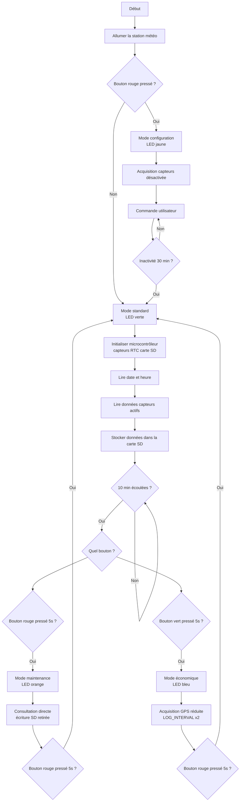
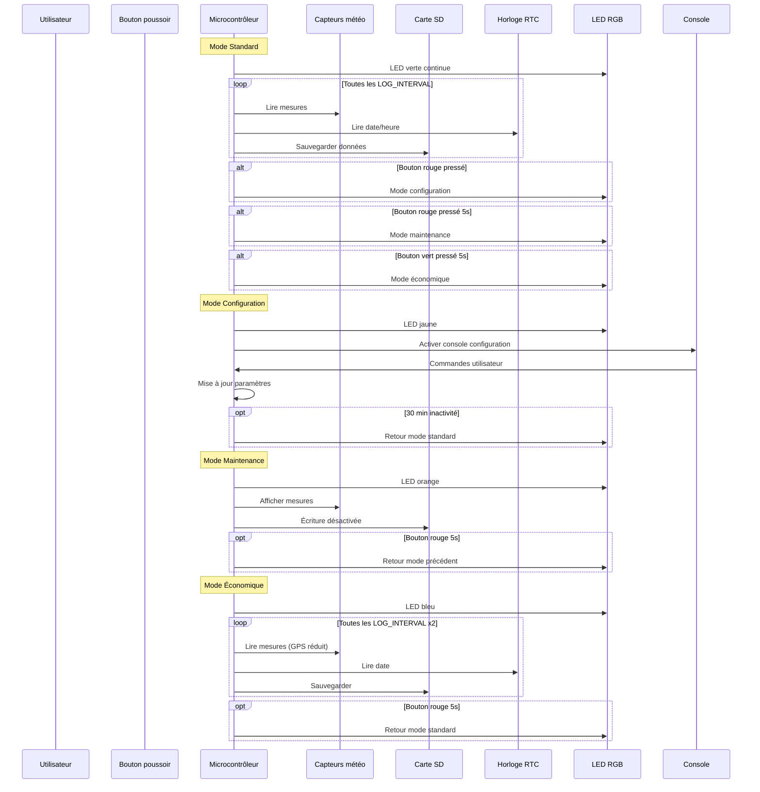
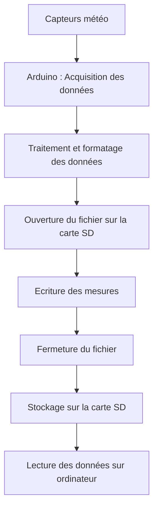

# Projet : Worldwide Weather Watcher


## Erradi Hatim; Sacha Lagnitre; Lett Killian; Cid Clément 

# Livrable 2 : Architecture du programme

# 1. Les diagrammes UML/SysML

## 1.1 Diagramme d'activité :

Ce diagramme d'activité décrit le fonctionnement général de la station météo et la gestion des différents modes du système.

Au démarrage, la station initialise le microcontrôleur ainsi que tous les périphériques nécessaires : capteurs météorologiques, horloge temps réel (RTC) et carte SD.

En mode standard, la LED verte est allumée en continu et la station effectue périodiquement les opérations suivantes :

* lecture des capteurs (température, humidité, pression, GPS),
* récupération de la date et de l’heure via le module RTC,
* sauvegarde des données sur la carte SD.

Le système vérifie régulièrement si un bouton a été pressé afin de changer de mode de fonctionnement.

Trois modes supplémentaires sont disponibles :

* **Mode configuration** : permet à l’utilisateur de modifier les paramètres via une console.
* **Mode maintenance** : permet de consulter directement les mesures sans enregistrer de données.
* **Mode économique** : réduit la fréquence d’acquisition afin de diminuer la consommation énergétique.

Après une période d’inactivité, le système revient automatiquement au mode standard.



## 1.2 Diagramme de séquence: 

Ce diagramme de séquence représente les interactions entre les différents composants du système : l’utilisateur, le microcontrôleur, les capteurs météorologiques, la carte SD, l’horloge RTC et les interfaces d’affichage.

En mode standard, le microcontrôleur lit périodiquement les mesures fournies par les capteurs, récupère la date et l’heure depuis le module RTC, puis enregistre les données sur la carte SD.

Lorsque l’utilisateur appuie sur un bouton, le microcontrôleur peut changer de mode de fonctionnement :

* **Mode configuration** : activation de la console pour modifier les paramètres du système.
* **Mode maintenance** : affichage des mesures sans enregistrement.
* **Mode économique** : réduction de la fréquence d’acquisition pour économiser l’énergie.

Le diagramme illustre également les conditions permettant de revenir au mode standard après une période d’inactivité ou après une action de l’utilisateur.




# 2. Structures logicielles du programme

## 2.1 Initialisation des périphériques

Au début du programme, on initialise tous les périphériques utilisés par la station météo.  
Le but est de déclarer dès le départ tous les composants matériels pour que le reste du code soit plus clair et plus simple à suivre.

Dans notre programme, on retrouve par exemple :

- l’écran LCD
- l’horloge temps réel RTC
- le module GPS
- la LED RGB
- le capteur DHT11 pour la température et l’humidité
- une liaison série logicielle pour communiquer avec le GPS

```c
rgb_lcd      lcd;
RTC_DS1307   rtc;
TinyGPSPlus gps;

ChainableLED led(8, 9, 1);
DHT          dht(6, DHT11);
SoftwareSerial gpsSerial(4, 5);  // RX, TX
```

Le programme définit aussi plusieurs constantes pour les broches utilisées.

```c
#define LUMIN_PIN      A1
#define BOUTON_ROUGE   2
#define BOUTON_VERT    3
#define SD_CS          10
#define EEPROM_SIGNATURE 0x42
```

Cela permet d’éviter de mettre directement des numéros de broches dans tout le code.  
Le programme devient donc plus lisible et plus facile à modifier si jamais le câblage change.


## 2.2 Structure de configuration

Comme dans la première version du programme, tous les paramètres importants sont regroupés dans une structure appelée `Variable`.

L’idée est simple : au lieu d’avoir plein de variables séparées un peu partout dans le code, on rassemble toute la configuration dans une seule structure.

Dans cette structure, on retrouve par exemple :

- les paramètres généraux
- les temporisations
- les seuils des capteurs
- l’activation ou non de certains capteurs
- la taille maximale du fichier de sauvegarde

```c
struct Variable {
    unsigned int DUREE_APPUI_LONG;
    unsigned int CONFIG_TIMEOUT;
    unsigned int LOG_INTERVAL;
    unsigned int FILE_MAX_SIZE;

    bool LUMIN;
    int LUMIN_LOW;
    int LUMIN_HIGH;

    bool TEMP_AIR;
    int MIN_TEMP_AIR;
    int MAX_TEMP_AIR;

    bool HYGR;
    int HYGR_MINT;
    int HYGR_MAXT;

    bool PRESSURE;
    int PRESSURE_MIN;
    int PRESSURE_MAX;
};
```

Ensuite, une variable globale appelée `config` contient les paramètres actifs du système.

```c
Variable config = {
    3000, 20000, 10000, 4096,
    1, 255, 768,
    1, -10, 60,
    1, 0, 50,
    1, 850, 1080
};
```

Ces valeurs correspondent aux réglages par défaut utilisés au démarrage du programme.


## 2.3 Sauvegarde des paramètres dans l’EEPROM

Pour éviter de perdre les paramètres lors d’un redémarrage, la configuration est sauvegardée dans la mémoire **EEPROM**.

Deux fonctions sont utilisées pour gérer cela :

- `sauvegarderEEPROM()`
- `chargerEEPROM()`

La fonction `sauvegarderEEPROM()` enregistre la structure `config` dans l’EEPROM.

```c
void sauvegarderEEPROM() {
  EEPROM.update(0, EEPROM_SIGNATURE);
  EEPROM.put(1, config);
}
```

La fonction `chargerEEPROM()` permet ensuite de relire les paramètres au démarrage.

```c
bool chargerEEPROM() {
  if(EEPROM.read(0) != EEPROM_SIGNATURE){
    Serial.println(F("EEPROM invalide, valeurs par defaut"));
    return false;
  }
  EEPROM.get(1, config);
  return true;
}
```

Une signature (`EEPROM_SIGNATURE`) est utilisée pour vérifier que les données présentes en mémoire sont valides.

Si la signature n’est pas correcte, le programme considère que l’EEPROM n’est pas initialisée correctement et il garde donc les valeurs par défaut.


## 2.4 Machine à états : gestion des modes

Le fonctionnement global du programme repose sur une **machine à états**.  
Cela veut dire que la station météo peut fonctionner dans plusieurs modes différents selon la situation.

Ces modes sont définis dans l’énumération `ModeCapteur`.

```c
enum ModeCapteur {
    STANDARD,
    CONFIGURATION,
    MAINTENANCE,
    ECONOMIQUE
};
```

Le programme utilise ensuite deux variables pour suivre le mode actuel et le mode précédent.

```c
ModeCapteur modeActuel    = STANDARD;
ModeCapteur modePrecedent = STANDARD;
```

Chaque mode correspond à un comportement précis :

- **STANDARD** : fonctionnement normal de la station météo
- **CONFIGURATION** : modification des paramètres via le port série
- **MAINTENANCE** : test des capteurs sans écrire sur la carte SD
- **ECONOMIQUE** : réduction de certaines opérations pour économiser l’énergie

Cette organisation permet d’avoir un programme plus propre, car chaque comportement est séparé.


## 2.5 Gestion des erreurs

Dans cette nouvelle version, un système de gestion des erreurs a été ajouté.  
C’est important, car cela permet au programme de détecter certains problèmes et de les signaler.

Les erreurs possibles sont regroupées dans l’énumération suivante :

```c
enum TypeErreur {
  ERREUR_AUCUNE,
  ERREUR_RTC,
  ERREUR_GPS,
  ERREUR_CAPTEUR,
  ERREUR_CAPTEUR_INCOHERENT,
  ERREUR_SD_PLEINE,
  ERREUR_SD_ECRITURE
};
```

L’erreur actuelle est stockée dans la variable suivante.

```c
TypeErreur erreurActuelle = ERREUR_AUCUNE;
```

Le programme utilise aussi quelques variables supplémentaires pour gérer le clignotement de la LED lorsqu’une erreur est détectée.

```c
unsigned long lastBlink = 0;
bool etatLED = false;
```

Grâce à cela, la station peut signaler visuellement un problème, par exemple une erreur GPS, un problème capteur ou un défaut d’écriture sur la carte SD.


## 2.6 Gestion du temps avec des timers

Le programme utilise plusieurs variables de type `unsigned long` pour gérer les actions périodiques.

```c
unsigned long lastMeasure      = 0;
unsigned long lastLCDRefresh   = 0;
unsigned long derniereActivite = 0;
```

Ces timers servent notamment à :

- déclencher les mesures à intervalles réguliers
- rafraîchir l’écran LCD
- détecter l’inactivité en mode configuration

Cette méthode est très utilisée sur Arduino, car elle permet d’éviter de bloquer le programme avec de longues temporisations.


## 2.7 Gestion des boutons avec interruptions

Le système utilise deux boutons :

- un bouton rouge
- un bouton vert

Pour améliorer la réactivité du programme, la gestion des boutons passe par des **interruptions**.

Deux indicateurs `volatile` sont utilisés pour signaler qu’un événement a eu lieu sur un bouton.

```c
volatile bool rougeEvent = false;
volatile bool vertEvent  = false;
```

Les fonctions d’interruption sont les suivantes :

```c
void ISR_boutonRouge() { rougeEvent = true; }
void ISR_boutonVert()  { vertEvent  = true; }
```

Le programme conserve aussi les instants d’appui et les derniers temps de debounce.

```c
unsigned long debutRouge        = 0;
unsigned long debutVert         = 0;
unsigned long lastDebounceRouge = 0;
unsigned long lastDebounceVert  = 0;
```

Cela permet ensuite de distinguer correctement :

- les appuis courts
- les appuis longs
- les rebonds mécaniques des boutons


## 2.8 Utilisation d’un pointeur de fonction

Pour gérer les différents modes de manière plus propre, le programme utilise un **pointeur de fonction**.

Le type suivant est défini :

```c
typedef void (*ModeHandler)();
ModeHandler modeHandler = nullptr;
```

Chaque mode possède ensuite sa propre fonction :

```c
void modeStandard();
void modeConfiguration();
void modeMaintenance();
void modeEconomique();
```

Une fonction appelée `updateModeHandler()` permet d’associer la bonne fonction au mode actuel.

```c
void updateModeHandler(){
  switch(modeActuel){
    case STANDARD: modeHandler = &modeStandard; break;
    case CONFIGURATION: modeHandler = &modeConfiguration; break;
    case MAINTENANCE: modeHandler = &modeMaintenance; break;
    case ECONOMIQUE: modeHandler = &modeEconomique; break;
  }
}
```

Ensuite, dans la boucle principale, il suffit simplement d’exécuter :

```c
if(modeHandler) modeHandler();
```

Cela permet d’appeler automatiquement la fonction correspondant au mode actif.

Cette technique rend le code plus propre et évite de mettre une grosse série de conditions dans la boucle principale.


## 2.9 Fonction utilitaire d’affichage de l’heure

Le programme contient une petite fonction utilitaire appelée `afficherHeure()`.

```c
void afficherHeure(Print &out, DateTime t) {
  if (t.hour() < 10) out.print('0'); out.print(t.hour()); out.print(':');
  if (t.minute() < 10) out.print('0'); out.print(t.minute()); out.print(':');
  if (t.second() < 10) out.print('0'); out.print(t.second());
}
```

Cette fonction permet d’afficher l’heure au bon format, avec des zéros devant si nécessaire.

Par exemple, au lieu d’avoir `8:5:3`, on obtient un affichage plus propre comme `08:05:03`.

Le fait de passer par une fonction dédiée évite aussi de répéter ce même code à plusieurs endroits.


## 2.10 Fonction de lecture, affichage et enregistrement des mesures

L’une des fonctions principales du programme est `afficherEtEnregistrer()`.

Cette fonction regroupe plusieurs tâches importantes :

- lecture de l’heure avec le RTC
- lecture de la température et de l’humidité avec le DHT11
- lecture de la luminosité
- lecture des coordonnées GPS
- affichage des données dans le moniteur série
- enregistrement éventuel des données sur la carte SD

```c
void afficherEtEnregistrer(bool ecrireSD) {
  DateTime t = rtc.now();
  float temp = dht.readTemperature();
  float hum  = dht.readHumidity();
  int lum    = analogRead(LUMIN_PIN);
  bool dhtOK = !isnan(temp) && !isnan(hum);
  if(!dhtOK) erreurActuelle = ERREUR_CAPTEUR;
  if(!gps.location.isValid()) erreurActuelle = ERREUR_GPS;

  Print &out = Serial;
  afficherHeure(out, t);

  if (dhtOK) {
    out.print(F(" | Temp: ")); out.print(temp);
    out.print(F(" | Hum: ")); out.print(hum);
  } else out.print(F(" | Temp: ERR | Hum: ERR"));

  out.print(F(" | Lum: ")); out.print(lum);

  if (gps.location.isValid()) {
    out.print(F(" | Lat: ")); out.print(gps.location.lat(), 6);
    out.print(F(" | Lon: ")); out.print(gps.location.lng(), 6);
  } else out.print(F(" | GPS: Pas de signal"));

  out.println();

  if(ecrireSD){
    File f = SD.open("meteo.txt", FILE_WRITE);
    if(f){
      afficherHeure(f, t);
      if(dhtOK){ f.print(F(" | Temp: ")); f.print(temp); f.print(F(" | Hum: ")); f.print(hum); }
      else f.print(F(" | Temp: ERR | Hum: ERR"));
      f.print(F(" | Lum: ")); f.print(lum);
      if(gps.location.isValid()){ f.print(F(" | Lat: ")); f.print(gps.location.lat(), 6); f.print(F(" | Lon: ")); f.print(gps.location.lng(), 6); }
      else f.print(F(" | GPS: ERR"));
      f.println(); f.close();
    } else Serial.println(F("Erreur ecriture SD !"));
      erreurActuelle = ERREUR_SD_ECRITURE;
  }
}
```

Le paramètre `ecrireSD` permet de choisir si les données doivent être sauvegardées sur la carte SD ou non.

Par exemple :

- en mode **STANDARD**, les données sont affichées et enregistrées
- en mode **MAINTENANCE**, elles sont affichées sans être enregistrées

Cette fonction centralise donc toute la logique de mesure du système.


## 2.11 Configuration du RTC

Le programme possède plusieurs fonctions pour configurer l’horloge temps réel directement depuis le port série.

### Configuration de l’heure

La fonction `configurerHeure()` permet de modifier l’heure au format `hh:mm:ss`.

```c
void configurerHeure(const char *val){
    int h, m, s;

    if(sscanf(val, "%d:%d:%d", &h, &m, &s) != 3){
        Serial.println(F("Format CLOCK invalide."));
        return;
    }

    if(h<0 || h>23 || m<0 || m>59 || s<0 || s>59){
        Serial.println(F("Valeurs heure invalides."));
        return;
    }

    DateTime now = rtc.now();
    rtc.adjust(DateTime(now.year(), now.month(), now.day(), h, m, s));

    Serial.println(F("Heure mise a jour."));
}
```

### Configuration de la date

La fonction `configurerDate()` permet de modifier la date.

```c
void configurerDate(const char *val){
    int mois, jour, annee;

    if(sscanf(val, "%d,%d,%d", &mois, &jour, &annee) != 3){
        Serial.println(F("Format DATE invalide."));
        return;
    }

    if(mois<1 || mois>12 || jour<1 || jour>31 || annee<2000 || annee>2099){
        Serial.println(F("Valeurs date invalides."));
        return;
    }

    DateTime now = rtc.now();
    rtc.adjust(DateTime(annee, mois, jour, now.hour(), now.minute(), now.second()));

    Serial.println(F("Date mise a jour."));
}
```

### Configuration du jour

La fonction `configurerJour()` permet de traiter le jour de la semaine à partir d’abréviations comme `MON`, `TUE`, `WED`, etc.

```c
void configurerJour(const char *val){
    int day = -1;

    if(strcmp(val,"MON")==0) day=1;
    else if(strcmp(val,"TUE")==0) day=2;
    else if(strcmp(val,"WED")==0) day=3;
    else if(strcmp(val,"THU")==0) day=4;
    else if(strcmp(val,"FRI")==0) day=5;
    else if(strcmp(val,"SAT")==0) day=6;
    else if(strcmp(val,"SUN")==0) day=0;

    if(day == -1){
        Serial.println(F("Jour invalide."));
        return;
    }

    DateTime now = rtc.now();

    rtc.adjust(DateTime(now.year(), now.month(), now.day(),
                        now.hour(), now.minute(), now.second()));

    Serial.println(F("Jour de semaine mis a jour."));
}
```

Ces fonctions permettent de régler l’horloge sans avoir besoin de reprogrammer la carte.


## 2.12 Réinitialisation des paramètres

Le programme possède aussi une fonction `resetParametres()` qui permet de remettre toute la configuration par défaut.

```c
void resetParametres() {
    config = {
        3000, 20000, 10000, 4096,
        1, 255, 768,
        1, -10, 60,
        1, 0, 50,
        1, 850, 1080
    };
    sauvegarderEEPROM();
    Serial.println(F("Paramètres réinitialisés par défaut."));
}
```

Cette fonction est utilisée avec la commande RESET lorsque le programme est en mode configuration.


## 2.13 Gestion des commandes série en mode configuration

En mode configuration, le programme peut recevoir différentes commandes depuis le moniteur série.

Toute cette logique est regroupée dans la fonction `traiterCommande()`.

```c
void traiterCommande(char *cmd){

    if(strncmp(cmd, "CLOCK ", 6) == 0){configurerHeure(cmd + 6);return;}

    if(strncmp(cmd, "DATE ", 5) == 0){configurerDate(cmd + 5);return;}

    if(strncmp(cmd, "DAY ", 4) == 0){configurerJour(cmd + 4);return;}

    if(strcmp(cmd, "RESET") == 0){resetParametres();return;}

    else if(strcmp(cmd, "VERSION") == 0){Serial.println(F("Station Meteo CESI - Version 1.0"));return;}

    char *sep = strchr(cmd, '=');
    if(sep == NULL) return;

    *sep = '\0';
    char *varName = cmd;
    int valeur = atoi(sep + 1);

    if(strcmp(varName, "LOG_INTERVAL") == 0)          config.LOG_INTERVAL = valeur * 1000;
    else if(strcmp(varName, "DUREE_APPUI_LONG") == 0) config.DUREE_APPUI_LONG = valeur * 1000;
    else if(strcmp(varName, "CONFIG_TIMEOUT") == 0)   config.CONFIG_TIMEOUT = valeur * 1000;
    else if(strcmp(varName, "FILE_MAX_SIZE") == 0)   config.FILE_MAX_SIZE = valeur;

    else if(strcmp(varName, "LUMIN") == 0)            config.LUMIN = valeur != 0;
    else if(strcmp(varName, "LUMIN_LOW") == 0)        config.LUMIN_LOW = valeur;
    else if(strcmp(varName, "LUMIN_HIGH") == 0)       config.LUMIN_HIGH = valeur;

    else if(strcmp(varName, "TEMP_AIR") == 0)         config.TEMP_AIR = valeur != 0;
    else if(strcmp(varName, "MIN_TEMP_AIR") == 0)     config.MIN_TEMP_AIR = valeur;
    else if(strcmp(varName, "MAX_TEMP_AIR") == 0)     config.MAX_TEMP_AIR = valeur;

    else if(strcmp(varName, "HYGR") == 0)             config.HYGR = valeur != 0;
    else if(strcmp(varName, "HYGR_MINT") == 0)        config.HYGR_MINT = valeur;
    else if(strcmp(varName, "HYGR_MAXT") == 0)        config.HYGR_MAXT = valeur;

    else if(strcmp(varName, "PRESSURE") == 0)         config.PRESSURE = valeur != 0;
    else if(strcmp(varName, "PRESSURE_MIN") == 0)     config.PRESSURE_MIN = valeur;
    else if(strcmp(varName, "PRESSURE_MAX") == 0)     config.PRESSURE_MAX = valeur;

    else{
        Serial.println(F("Commande inconnue"));
    }

    sauvegarderEEPROM();

    Serial.print(varName);
    Serial.println(F(" modifications appliquees"));
}
```

Cette fonction permet notamment :

- de régler l’heure avec `CLOCK`
- de régler la date avec `DATE`
- de régler le jour avec `DAY`
- de remettre les paramètres à zéro avec `RESET`
- d’afficher la version du programme avec `VERSION`
- de modifier directement certaines variables avec la syntaxe `NOM_VARIABLE=valeur`

Après chaque modification, les paramètres sont sauvegardés dans l’EEPROM.


## 2.14 Gestion détaillée des modes de fonctionnement

Chaque mode possède sa propre fonction, ce qui rend le programme plus simple à comprendre.

### Mode standard

Le mode standard correspond au fonctionnement normal de la station.

```c
void modeStandard() {
  setLEDMode();
  if(millis() - lastMeasure >= config.LOG_INTERVAL){
    lastMeasure = millis();
    afficherEtEnregistrer(true);
  }
}
```

Dans ce mode, les mesures sont réalisées régulièrement et enregistrées sur la carte SD.

### Mode configuration

Le mode configuration permet de recevoir des commandes via le port série.

```c
void modeConfiguration() {
  setLEDMode();
  if(Serial.available()){
    char commande[40];
    Serial.readBytesUntil('\n', commande, sizeof(commande));
    traiterCommande(commande);
    derniereActivite = millis();
  }
}
```

### Mode maintenance

Le mode maintenance permet de tester les mesures sans écrire sur la carte SD.

```c
void modeMaintenance() {
  setLEDMode();
  if(millis() - lastMeasure >= config.LOG_INTERVAL){
    lastMeasure = millis();
    afficherEtEnregistrer(false);
  }
}
```

### Mode économique

Le mode économique réduit la fréquence de certaines opérations pour économiser de l’énergie.

```c
void modeEconomique() {
  setLEDMode();
  unsigned long now = millis();
  if(now - lastMeasure >= config.LOG_INTERVAL*2){
    lastMeasure = now;
    compteurEco++;
    if(compteurEco % 2 == 0){
      Serial.println(F("GPS ACTIF"));
      while(gpsSerial.available()) gps.encode(gpsSerial.read());
    } else Serial.println(F("GPS DESACTIVE"));
    afficherEtEnregistrer(true);
  }
}
```

Dans ce mode, les mesures sont moins fréquentes et le GPS n’est activé qu’un cycle sur deux.


## 2.15 Gestion de la LED RGB

La LED RGB sert ici à deux choses :

- indiquer le mode de fonctionnement actuel
- signaler les erreurs détectées

### Couleur selon le mode

La fonction `setLEDMode()` définit une couleur différente pour chaque mode.

```c
void setLEDMode() {
  switch(modeActuel){
    case STANDARD:      led.setColorRGB(0, 0, 100, 0); break;
    case CONFIGURATION: led.setColorRGB(0, 100, 100, 100); break;
    case MAINTENANCE:   led.setColorRGB(0, 100, 50, 0); break;
    case ECONOMIQUE:    led.setColorRGB(0, 0, 0, 100); break;
  }
}
```

Par exemple :

- vert pour le mode standard
- blanc pour le mode configuration
- jaune pour le mode maintenance
- bleu pour le mode économique

### Gestion visuelle des erreurs

La fonction `gererLEDErreur()` fait clignoter la LED selon le type d’erreur détecté.

```c
void gererLEDErreur() {
  if(erreurActuelle == ERREUR_AUCUNE) return;

  unsigned long interval = 4000;
  if(erreurActuelle == ERREUR_CAPTEUR_INCOHERENT || erreurActuelle == ERREUR_SD_ECRITURE){
    interval = 8000;
  }

  if(millis() - lastBlink >= interval){
    lastBlink = millis();

    if(erreurActuelle == ERREUR_CAPTEUR_INCOHERENT || erreurActuelle == ERREUR_SD_ECRITURE){
        etatLED = !etatLED;
    } else {
        etatLED = !etatLED;
    }
  }

  switch(erreurActuelle){
    case ERREUR_RTC:
      if(etatLED) led.setColorRGB(0,255,0,0);
      else        led.setColorRGB(0,0,0,255);
      break;

    case ERREUR_GPS:
      if(etatLED) led.setColorRGB(0,255,0,0);
      else        led.setColorRGB(0,255,255,0);
      break;

    case ERREUR_CAPTEUR:
      if(etatLED) led.setColorRGB(0,255,0,0);
      else        led.setColorRGB(0,0,255,0);
      break;

    case ERREUR_CAPTEUR_INCOHERENT:
      if(etatLED) led.setColorRGB(0,255,0,0);
      else        led.setColorRGB(0,0,255,0);
      break;

    case ERREUR_SD_PLEINE:
      if(etatLED) led.setColorRGB(0,255,0,0);
      else        led.setColorRGB(0,255,255,255);
      break;

    case ERREUR_SD_ECRITURE:
      if(etatLED) led.setColorRGB(0,255,0,0);
      else        led.setColorRGB(0,255,255,255);
      break;

    default:
      break;
  }
}
```

Cette gestion visuelle est pratique car elle permet de repérer rapidement un problème sans devoir forcément regarder le moniteur série.


## 2.16 Affichage sur l’écran LCD

L’écran LCD est mis à jour régulièrement grâce à la fonction `afficherLCD()`.

```c
void afficherLCD(){
  unsigned long now = millis();
  if(now - lastLCDRefresh < LCD_REFRESH) return;
  lastLCDRefresh = now;

  DateTime t = rtc.now();
  lcd.setCursor(0,0); afficherHeure(lcd,t);
  lcd.setCursor(0,1);
  switch(modeActuel){
    case STANDARD:      lcd.print(F("Mode: STANDARD  ")); break;
    case CONFIGURATION: lcd.print(F("Mode: CONFIG    ")); break;
    case MAINTENANCE:   lcd.print(F("Mode: MAINT     ")); break;
    case ECONOMIQUE:    lcd.print(F("Mode: ECO       ")); break;
  }
}
```

La première ligne affiche l’heure courante et la deuxième ligne affiche le mode actif.

Cela permet à l’utilisateur de voir directement dans quel état se trouve la station.


## 2.17 Gestion générique des boutons

Pour éviter de répéter deux fois la même logique, le programme utilise une fonction générique appelée `traiterBouton()`.

```c
void traiterBouton(uint8_t pin, volatile bool &eventFlag, unsigned long &debut, unsigned long &lastDebounce, void (*actionCourte)(), void (*actionLongue)()){
  if(!eventFlag) return;
  eventFlag = false;

  unsigned long now = millis();
  if(now - lastDebounce < DEBOUNCE_DELAY) return;
  lastDebounce = now;

  bool etat = digitalRead(pin);
  if(etat == LOW) debut = now;
  else {
    unsigned long duree = now - debut;
    if(duree >= config.DUREE_APPUI_LONG && actionLongue) actionLongue();
    else if(duree < config.DUREE_APPUI_LONG && actionCourte) actionCourte();
  }
}
```

Cette fonction permet de :

- détecter un changement d’état sur un bouton
- appliquer un anti-rebond
- mesurer la durée de l’appui
- appeler automatiquement l’action courte ou l’action longue

Cela évite de dupliquer du code pour chaque bouton.


## 2.18 Actions associées aux boutons

Les actions concrètes des boutons sont définies dans plusieurs petites fonctions.

### Appui court sur le bouton rouge

```c
void rougeCourte(){ 
  modeActuel = CONFIGURATION;
  derniereActivite = millis();
  lastLCDRefresh=0;
  updateModeHandler();
}
```

Cet appui permet d’entrer en mode configuration.

### Appui long sur le bouton rouge

```c
void rougeLongue(){
  if(modeActuel==STANDARD){ modePrecedent=STANDARD; modeActuel=MAINTENANCE; lastLCDRefresh=0; }
  else if(modeActuel==ECONOMIQUE){ modeActuel=STANDARD; lastLCDRefresh=0; }
  else if(modeActuel==MAINTENANCE){ modeActuel=modePrecedent; lastLCDRefresh=0; }
  updateModeHandler();
}
```

Cet appui permet par exemple de passer en mode maintenance ou de revenir au mode précédent.

### Appui long sur le bouton vert

```c
void vertLongue(){
  if(modeActuel==STANDARD){ modePrecedent=STANDARD; modeActuel=ECONOMIQUE; lastLCDRefresh=0; updateModeHandler(); }
}
```

Cet appui permet de passer en mode économique.


## 2.19 Fonction `setup()`

Comme dans tous les programmes Arduino, la fonction `setup()` est exécutée une seule fois au démarrage du système.

```c
void setup(){
  Serial.begin(9600);
  gpsSerial.begin(9600);
  Wire.begin();

  if(!rtc.begin()) Serial.println(F("Erreur RTC !"));
  if(!rtc.isrunning()){ rtc.adjust(DateTime(F(__DATE__),F(__TIME__))); }

  dht.begin();
  pinMode(LUMIN_PIN, INPUT);
  pinMode(BOUTON_ROUGE, INPUT_PULLUP);
  pinMode(BOUTON_VERT, INPUT_PULLUP);

  lcd.begin(16,2); lcd.setRGB(0,255,0);

  if(!SD.begin(SD_CS)) Serial.println(F("Erreur carte SD !"));
  else{
    Serial.println(F("Carte SD OK"));
    if(SD.exists("meteo.txt")) {
      SD.remove("meteo.txt");
      Serial.println(F("Anciennes donnees effacees"));
    }
  }

  attachInterrupt(digitalPinToInterrupt(BOUTON_ROUGE), ISR_boutonRouge, CHANGE);
  attachInterrupt(digitalPinToInterrupt(BOUTON_VERT),  ISR_boutonVert,  CHANGE);

  chargerEEPROM();

  modeActuel = STANDARD;
  updateModeHandler();
  Serial.println(F("Systeme demarre."));
}
```

Cette fonction permet notamment :

- d’initialiser les communications série
- de démarrer le GPS
- d’initialiser le bus I2C
- de démarrer le RTC
- d’initialiser le capteur DHT11
- de configurer les broches d’entrée
- de démarrer l’écran LCD
- d’initialiser la carte SD
- d’attacher les interruptions des boutons
- de charger la configuration depuis l’EEPROM
- de définir le mode de fonctionnement initial


## 2.20 Fonction `loop()`

La fonction `loop()` correspond à la boucle principale du programme.  
Elle est exécutée en continu tant que le système est alimenté.

```c
void loop(){
  unsigned long now = millis();

  while(gpsSerial.available()) gps.encode(gpsSerial.read());

  traiterBouton(BOUTON_ROUGE, rougeEvent, debutRouge, lastDebounceRouge, rougeCourte, rougeLongue);
  traiterBouton(BOUTON_VERT,  vertEvent,  debutVert,  lastDebounceVert,  nullptr, vertLongue);

  if(modeActuel==CONFIGURATION && now-derniereActivite>=config.CONFIG_TIMEOUT){
    modeActuel=STANDARD;
    updateModeHandler();
    lastLCDRefresh=0;
  }

  if(modeHandler) modeHandler();
  afficherLCD();
  if(erreurActuelle != ERREUR_AUCUNE) gererLEDErreur();
  delay(50);
}
```

Dans cette boucle, le programme :

- lit les données GPS
- gère les événements liés aux boutons
- vérifie le temps d’inactivité en mode configuration
- exécute la fonction correspondant au mode courant
- met à jour l’écran LCD
- gère les erreurs avec la LED
- recommence en continu

Cette organisation permet au système de fonctionner en permanence tout en restant réactif aux actions de l’utilisateur et aux événements matériels.

# Livrable 4- Documentation

# Documentation technique

# 1. Fonctionnement global du système 

Le système a pour objectif de collecter les données des capteurs de la station météo et de les enregistrer sur une carte SD afin de conserver les mesures sur une longue durée, et le prototype repose sur une carte Arduino. 

Le fonctionnement du systéme se déroule sur plusieurs étapes:



1. Les capteurs mesurent les paramètres météorologiques (température, pression, humidité).

2. L’Arduino récupère ces données.

3. Les données sont formatées sous forme de ligne de texte.

4. La carte SD est initialisée par le programme.

5. Les données sont écrites dans un fichier d’archivage.

6. Le fichier est fermé afin de sauvegarder correctement les données.

Le système recommence le processus pour chaque nouvelle mesure.

Le fonctionnement global du système repose sur un cycle d’acquisition et d’enregistrement des données.
Dans un premier temps, les capteurs mesurent les différentes grandeurs physiques comme la température, la pression ou l’humidité. Ces informations sont ensuite transmises à la carte Arduino.
L’Arduino traite ces données et les convertit dans un format exploitable. Une fois les données prêtes, le programme ouvre un fichier d’archivage sur la carte SD.
Les mesures sont ensuite écrites dans ce fichier, puis le fichier est fermé afin d’assurer la sauvegarde correcte des informations.
Ce processus se répète automatiquement à intervalles réguliers afin d’enregistrer les données tout au long de l’utilisation de la station météo.
Les données enregistrées peuvent ensuite être récupérées en retirant la carte SD et en l’insérant dans un ordinateur.

# 2. Architecture générale du programme

Le programme de la station météo est organisé en plusieurs modules permettant de gérer les capteurs, l’affichage, l’enregistrement des données et l’interaction avec l’utilisateur. Cette organisation modulaire facilite la compréhension du code et permet de maintenir plus facilement le système.

Le programme Arduino repose sur deux fonctions principales :

- `setup()` : exécutée une seule fois au démarrage du système.
- `loop()` : exécutée en continu pendant toute la durée de fonctionnement de la station.

---

# 3. Initialisation du système

Lors du démarrage, la fonction `setup()` initialise tous les périphériques nécessaires au fonctionnement du système.

Les éléments suivants sont configurés :

- la communication série pour l’affichage des informations
- le module GPS
- le bus I²C pour la communication avec certains capteurs
- l’horloge temps réel (RTC)
- le capteur de température et d’humidité
- le capteur de luminosité
- l’écran LCD
- la carte SD pour le stockage des données
- les boutons permettant d’interagir avec le système

La configuration enregistrée dans la mémoire **EEPROM** est également chargée afin de restaurer les paramètres précédemment définis.

---

# 4. Organisation en modes de fonctionnement

Le système possède plusieurs **modes de fonctionnement** permettant d’adapter le comportement de la station selon les besoins.

| Mode | Description |
|-----|-----|
| **Standard** | fonctionnement normal avec acquisition et enregistrement des données |
| **Configuration** | modification des paramètres via le port série |
| **Maintenance** | affichage des données des capteurs sans enregistrement |
| **Économique** | réduction de la fréquence des mesures pour économiser l’énergie |

Chaque mode est associé à une fonction spécifique chargée d’exécuter les opérations correspondantes. Le programme utilise un **pointeur de fonction** permettant d’exécuter dynamiquement la fonction correspondant au mode actif.

---

# 5. Acquisition et traitement des données

Les données environnementales sont collectées à partir de plusieurs capteurs :

- **DHT11** : mesure de la température et de l’humidité  
- **Capteur analogique** : mesure de la luminosité  
- **Module GPS** : récupération des coordonnées géographiques  
- **Module RTC** : gestion de la date et de l’heure  

Les informations collectées sont ensuite traitées et formatées afin d’être affichées et enregistrées dans un format lisible.

---

# 6. Affichage des informations

Les informations du système sont affichées sur deux interfaces :

- le **moniteur série**, utilisé pour le suivi et le diagnostic
- l’**écran LCD**, qui affiche l’heure actuelle ainsi que le mode de fonctionnement actif

L’affichage est mis à jour régulièrement afin de fournir des informations en temps réel à l’utilisateur.

---

# 7. Enregistrement des données

Les données collectées peuvent être enregistrées sur une **carte SD** dans un fichier nommé :


# Documentation utilisateur - Station météo embarquée


# 1. Contexte du projet

Dans le cadre du projet **Worldwide Weather Watcher**, l’Agence Internationale pour la Vigilance Météorologique (AIVM) souhaite améliorer la surveillance des phénomènes météorologiques dangereux comme les cyclones et tempêtes tropicales.

Pour cela, l’agence déploie des **stations météo embarquées sur des navires commerciaux**. Ces stations permettent de mesurer et enregistrer plusieurs paramètres environnementaux importants afin de mieux comprendre et anticiper les phénomènes météorologiques extrêmes.

Le système doit être :

- simple à utiliser
- fiable en environnement maritime
- accessible à un membre de l’équipage sans compétences techniques avancées

Cette documentation a pour objectif de **guider l’utilisateur final dans l’utilisation de la station météo embarquée**.


# 2. Présentation du système

La station météo est un système embarqué basé sur un microcontrôleur qui collecte et enregistre plusieurs données météorologiques.

Le système repose sur :

- Arduino Uno  
- microcontrôleur ATmega328

Le microcontrôleur gère :

- l’acquisition des données des capteurs
- l’enregistrement des données
- les modes de fonctionnement
- l’interface utilisateur (LED, boutons, écran)


# 3. Composants du système

## 3.1 Capteurs météorologiques

La station mesure plusieurs paramètres environnementaux.

### Température et humidité

Capteur utilisé :
- DHT11
  


Mesures :

- température de l’air
- humidité relative


### Luminosité

Capteur analogique permettant de mesurer l’intensité lumineuse ambiante.


### Position GPS


Le module GPS permet d’obtenir :

- la latitude
- la longitude

Ces données permettent de **localiser précisément la position du navire lors de chaque mesure**.


### Horloge temps réel

Module utilisé :

- RTC DS1307
  


Fonction :

- fournir la date et l’heure
- horodater les données enregistrées


### Carte SD

Un lecteur de carte SD permet de **stocker les données météorologiques enregistrées**.


Chaque ligne du fichier contient :

- la date
- l’heure
- les données des capteurs
- la position GPS


# 4. Interface utilisateur

L’utilisateur interagit avec le système grâce à :

- une LED RGB

  
  
- un écran LCD


- 2 boutons poussoirs
  


Ces éléments permettent de **contrôler les modes du système et vérifier son état de fonctionnement**.


# 5. Boutons de contrôle

## Bouton rouge

Le bouton rouge permet d’accéder aux modes avancés.

**Appui court :**

→ passage en **mode configuration**

**Appui long (5 secondes) :**

→ passage en **mode maintenance**

Si le système est déjà en mode maintenance, un appui long permet de **revenir au mode précédent**.


## Bouton vert

**Appui long (5 secondes) :**

→ activation du **mode économique**

Ce mode est accessible uniquement depuis le mode standard.


# 6. Indicateurs LED

Une LED RGB indique l’état du système.

| Couleur LED | État du système |
|-------------|----------------|
| Vert | Mode standard |
| Jaune | Mode configuration |
| Bleu | Mode économique |
| Orange | Mode maintenance |

Ces couleurs permettent à l’utilisateur **d’identifier rapidement le mode actif du système**.


# 7. Signaux d’erreur

Certaines combinaisons de couleurs indiquent une erreur.

| Signal LED | Signification |
|------------|--------------|
| Rouge + Bleu clignotant | erreur horloge RTC |
| Rouge + Jaune clignotant | erreur GPS |
| Rouge + Vert clignotant | erreur capteur |
| Rouge + Vert clignotant (vert plus long) | données capteur incohérentes |
| Rouge + Blanc clignotant | carte SD pleine |
| Rouge + Blanc clignotant (blanc plus long) | erreur écriture carte SD |

Ces signaux permettent **d’identifier rapidement un problème matériel ou logiciel**.


# 8. Modes de fonctionnement

## La station météo possède **4 modes de fonctionnement**.

## 8.1 Mode Standard

 Le **mode standard** est le mode normal de fonctionnement.

Fonctionnement :

- acquisition des données des capteurs
- enregistrement sur la carte SD
- affichage sur l’écran LCD

Les mesures sont effectuées **toutes les 10 minutes par défaut**.

Les données sont enregistrées sous forme de lignes horodatées dans un fichier de log.


## 8.2 Mode Configuration

Ce mode permet de **configurer les paramètres du système** via l’interface série.

Exemples de commandes (voire en annexe le reste) :

LOG_INTERVAL=10
RESET
VERSION


Le système revient automatiquement en **mode standard après 30 minutes sans activité**.


## 8.3 Mode Maintenance

Dans ce mode :

- les données ne sont **plus écrites sur la carte SD**
- les capteurs peuvent être **consultés en direct sur le port série**
- la carte SD peut être retirée **sans risque de corruption des données**

Ce mode est utilisé pour :

- diagnostic
- maintenance du système


## 8.4 Mode Économique

Ce mode permet **d’économiser de l’énergie**.

Modifications du fonctionnement :

- acquisition GPS seulement **une mesure sur deux**
- intervalle entre mesures **multiplié par 2**

Ce mode est utile lorsque la station fonctionne sur batterie.


# 9. Utilisation du système

## 9.1 Démarrage

1. Alimenter la station météo
2. Le système démarre automatiquement en **mode standard**
3. La LED devient **verte**
4. Les mesures commencent automatiquement


## 9.2 Vérification du fonctionnement

L’utilisateur doit vérifier :

- la couleur de la LED
- l’affichage sur l’écran LCD
- la présence des fichiers sur la carte SD


# 10. Maintenance simple

En cas de problème :

1. vérifier l’alimentation du système
2. vérifier la présence de la carte SD
3. vérifier les connexions des capteurs
4. redémarrer le système


# Conclusion

La station météo du projet **Worldwide Weather Watcher** permet de collecter automatiquement des données environnementales importantes pour la surveillance météorologique mondiale.

Grâce à son interface simple (LED, boutons et écran), le système peut être utilisé facilement par l’équipage d’un navire sans connaissances techniques avancées.


# Annexe :

## Fonction du mode configuration

| Paramètre      | Description                                                                 | Exemple de commande    |
|----------------|-----------------------------------------------------------------------------|-----------------------|
| LUMIN          | définition de l’activation (1)/désactivation (0) du capteur de luminosité  | LUMIN=1               |
| LUMIN_LOW      | définition de la valeur en dessous de laquelle la luminosité est considérée comme "faible" | LUMIN_LOW=200         |
| LUMIN_HIGH     | définition de la valeur au-dessus de laquelle la luminosité est considérée comme "forte" | LUMIN_HIGH=700        |
| TEMP_AIR       | définition de l’activation (1)/désactivation (0) du capteur de température de l’air | TEMP_AIR=0            |
| MIN_TEMP_AIR   | définition du seuil de température de l’air (en °C) en dessous duquel le capteur se mettra en erreur | MIN_TEMP_AIR=-5       |
| MAX_TEMP_AIR   | définition du seuil de température de l’air (en °C) au-dessus duquel le capteur se mettra en erreur | MAX_TEMP_AIR=30       |
| HYGR           | définition de l’activation (1)/désactivation (0) du capteur d’humidité      | HYGR=1                |
| HYGR_MINT      | définition de la température en dessous de laquelle les mesures d’hygrométrie ne seront pas prises en compte | HYGR_MINT=0           |
| HYGR_MAXT      | définition de la température au-dessus de laquelle les mesures d’hygrométrie ne seront pas prises en compte | HYGR_MAXT=50          |
| PRESSURE       | définition de l’activation (1)/désactivation (0) du capteur de pression atmosphérique | PRESSURE=0           |
| PRESSURE_MIN   | définition du seuil de pression atmosphérique (en hPa) en dessous duquel le capteur se mettra en erreur | PRESSURE_MIN=450      |
| PRESSURE_MAX   | définition du seuil de pression atmosphérique (en hPa) au-dessus duquel le capteur se mettra en erreur | PRESSURE_MAX=1030     |

Le code complet se trouve dans la section Main.c
